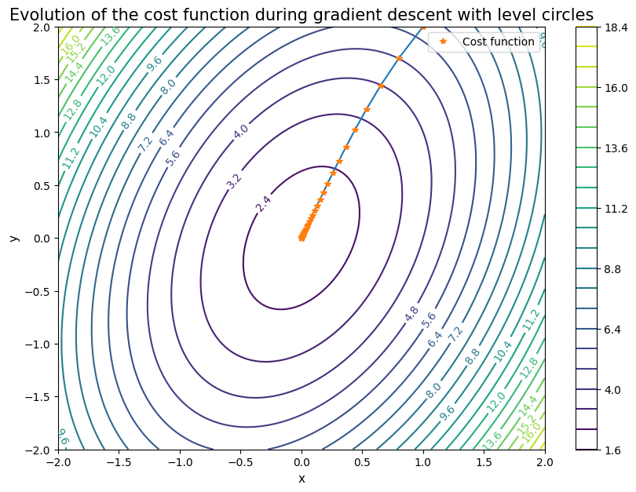
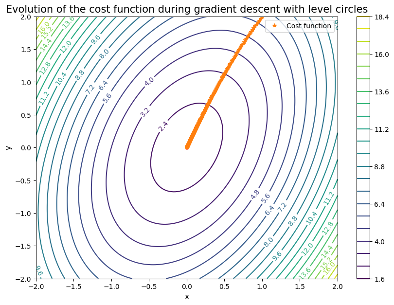
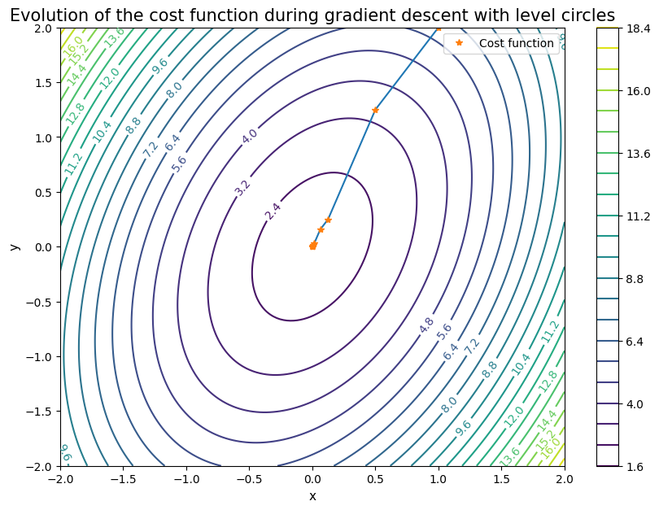

# Gradient descent

To find the infimum of an arbitrary cost function, we use here the gradient descent. Let us consider the function $f(x,y)=2x^2+y^2-xy+2$ that we aim at minimizing on $ \mathbb{R}^2$.
We start by manually compute its gradient and we will display its evolution during gradient descent.


```python
import sys
!{sys.executable} -m pip install numpy
!{sys.executable} -m pip install matplotlib
```

    Requirement already satisfied: numpy in /usr/local/Cellar/jupyterlab/4.2.1/libexec/lib/python3.12/site-packages (2.0.0)
    
    [notice] A new release of pip is available: 24.0 -> 24.2
    [notice] To update, run: /usr/local/Cellar/jupyterlab/4.2.1/libexec/bin/python -m pip install --upgrade pip
    Requirement already satisfied: matplotlib in /usr/local/Cellar/jupyterlab/4.2.1/libexec/lib/python3.12/site-packages (3.9.1)
    Requirement already satisfied: contourpy>=1.0.1 in /usr/local/Cellar/jupyterlab/4.2.1/libexec/lib/python3.12/site-packages (from matplotlib) (1.2.1)
    Requirement already satisfied: cycler>=0.10 in /usr/local/Cellar/jupyterlab/4.2.1/libexec/lib/python3.12/site-packages (from matplotlib) (0.12.1)
    Requirement already satisfied: fonttools>=4.22.0 in /usr/local/Cellar/jupyterlab/4.2.1/libexec/lib/python3.12/site-packages (from matplotlib) (4.53.1)
    Requirement already satisfied: kiwisolver>=1.3.1 in /usr/local/Cellar/jupyterlab/4.2.1/libexec/lib/python3.12/site-packages (from matplotlib) (1.4.5)
    Requirement already satisfied: numpy>=1.23 in /usr/local/Cellar/jupyterlab/4.2.1/libexec/lib/python3.12/site-packages (from matplotlib) (2.0.0)
    Requirement already satisfied: packaging>=20.0 in /usr/local/Cellar/jupyterlab/4.2.1/libexec/lib/python3.12/site-packages (from matplotlib) (24.0)
    Requirement already satisfied: pillow>=8 in /usr/local/Cellar/jupyterlab/4.2.1/libexec/lib/python3.12/site-packages (from matplotlib) (10.4.0)
    Requirement already satisfied: pyparsing>=2.3.1 in /usr/local/Cellar/jupyterlab/4.2.1/libexec/lib/python3.12/site-packages (from matplotlib) (3.1.2)
    Requirement already satisfied: python-dateutil>=2.7 in /usr/local/Cellar/jupyterlab/4.2.1/libexec/lib/python3.12/site-packages (from matplotlib) (2.9.0.post0)
    Requirement already satisfied: six>=1.5 in /usr/local/Cellar/jupyterlab/4.2.1/libexec/lib/python3.12/site-packages (from python-dateutil>=2.7->matplotlib) (1.16.0)
    
    [notice] A new release of pip is available: 24.0 -> 24.2
    [notice] To update, run: /usr/local/Cellar/jupyterlab/4.2.1/libexec/bin/python -m pip install --upgrade pip


```python
import numpy as np
import matplotlib.pyplot as plt
def f(x,y):
    return ...
def df(x,y):
    return ...
```

We need to define a norm to now how far from the global solution we are.


```python
def norm(a):
    return np.sqrt(a[0]**2+a[1]**2)
```


```python
## start GD algorithm
eps=1e-6
alpha=0.1 #test with alpha=1
x0,y0=1,2
evolution = [[x0, y0]]
grad_f = df(x0, y0)
while ...>=eps:
    d = ...
    x0, y0 = ...
    evolution = ...
    grad_f = ...


```


```python
evolution_X = evolution[:, 0]
evolution_Y = evolution[:, 1]
```


```python
x1 = np.linspace(-2, 2, 150)
y1 = np.linspace(-2, 2, 150)
Xx, Yy = np.meshgrid(x1, y1)
Z = fxy(Xx, Yy)
fig = plt.figure(figsize = (10,7))
contours = plt.contour(Xx, Yy, Z, 20)
plt.clabel(contours, inline = True, fontsize = 10)
plt.title("Evolution of the cost function during gradient descent with level circles", fontsize=15)
plt.plot(evolution_X, evolution_Y)
plt.plot(evolution_X, evolution_Y, '*', label = "Cost function")
plt.xlabel('x', fontsize=11)
plt.ylabel('y', fontsize=11)
plt.colorbar()
plt.legend(loc = "upper right")
plt.show()
```


    

    


With $\alpha=1$, the solution blows up, a correct choice for $\alpha$ is very important. That is why, we will proceed with Armijo rule: 


```python
c1=.6
beta=1. #test with beta=1
gamma=0.01

def phik(xyk,alphak,dk):
    return ...

def dphik(xyk,alphak,dk):
    grad_f=...
    return ...

def armijo_rule(alpha,xy_old,d): #d_x est la direction de descente d_x . grad_x <= 0
    # test f(x_new) \leq f(x_0) + c alpha ps{d_x}{grad_x}
    test = 1
    iter=0   
    while test!=0 and iter<500: 
        if phik(xy_old,alpha,d)<=...:     
            test = 0
        else:
            alpha*=gamma

        iter+=1
    return alpha    
    
#initialization for Armijo
alpha=beta

## start GD algorithm
eps=1e-6
x0,y0=1,2
evolution = [[x0, y0]]
grad_f = dfxy(x0, y0)
cpt_grad=0

while norm(grad_f)>=eps and cpt_grad<500:
    
    d = -grad_f
    #armijo
    alpha=beta
    xy_old=np.array([x0,y0])
    cpt=0
    alpha=armijo_rule(alpha,xy_old,d)
    #while phik(xy_old,alpha,d)>phik(xy_old,0,d)+c1*dphik(xy_old,0,d)*alpha and cpt<500:
    #    alpha*=gamma
    #    cpt+=1
    x0, y0 = x0 + alpha*d[0], y0 + alpha*d[1] 
    evolution = np.vstack((evolution, [x0, y0]))
    grad_f = dfxy(x0, y0)
    cpt_grad+=1


```


```python
evolution_X = evolution[:, 0]
evolution_Y = evolution[:, 1]
x1 = np.linspace(-2, 2, 150)
y1 = np.linspace(-2, 2, 150)
Xx, Yy = np.meshgrid(x1, y1)
Z = fxy(Xx, Yy)
fig = plt.figure(figsize = (10,7))
contours = plt.contour(Xx, Yy, Z, 20)
plt.clabel(contours, inline = True, fontsize = 10)
plt.title("Evolution of the cost function during gradient descent with level circles", fontsize=15)
plt.plot(evolution_X, evolution_Y)
plt.plot(evolution_X, evolution_Y, '*', label = "Cost function")
plt.xlabel('x', fontsize=11)
plt.ylabel('y', fontsize=11)
plt.colorbar()
plt.legend(loc = "upper right")
plt.show()
```


    

    


```python
# Wolfe rule:

c1=.6
c2=.8
beta=1 #test with beta=1
eta=2.
gamma=0.01

def phik(xyk,alphak,dk):
    return ...

def dphik(xyk,alphak,dk):
    grad_f=...
    return np.dot(grad_f,dk)

    
def wolfe_rule(alpha,xy_old,d): #d_x est la direction de descente d_x . grad_x <= 0
    # test f(x_new) \leq f(x_0) + c alpha ps{d_x}{grad_x}

    test = 1
    iteration = 0
    min_ = 0
    max_ = 1000
    while (phik(xy_old,alpha,d)<=...&(iteration<=500): #armijo ok
        alpha=eta*alpha
    iteration = 0
    while (test!=0)&(iteration<=500): 
        xnew0,xnew1=xy_old[0]+alpha*d[0],...
        if (phik(xy_old,alpha,d)<= (phik(xy_old,0,d)+c1*dphik(xy_old,0,d)*alpha)) & (np.dot(df(xnew0,xnew1),d) >= c2*np.dot(df(xy_old[0],xy_old[1]),d) ):
            test = 0
        elif phik(xy_old,alpha,d)> ...: #no armijo
            max_ = ...
            alpha = ...
            iteration = iteration +1
        else: # armijo ok
            minorant = ...
            alpha = ...
            iteration = iteration +1
    return alpha


#initialization for Armijo
alpha=beta

## start GD algorithm
eps=1e-6
x0,y0=1,2
evolution = [[x0, y0]]
grad_f = dfxy(x0, y0)
cpt_grad=0

while norm(grad_f)>=eps and cpt_grad<500:
    
    d = -grad_f
    #armijo
    alpha=beta
    xy_old=np.array([x0,y0])
    cpt=0
    alpha=wolfe_rule(alpha,xy_old,d)
    x0, y0 = x0 + alpha*d[0], y0 + alpha*d[1] 
    evolution = np.vstack((evolution, [x0, y0]))
    grad_f = dfxy(x0, y0)
    cpt_grad+=1

```


```python
evolution_X = evolution[:, 0]
evolution_Y = evolution[:, 1]
x1 = np.linspace(-2, 2, 150)
y1 = np.linspace(-2, 2, 150)
Xx, Yy = np.meshgrid(x1, y1)
Z = fxy(Xx, Yy)
fig = plt.figure(figsize = (10,7))
contours = plt.contour(Xx, Yy, Z, 20)
plt.clabel(contours, inline = True, fontsize = 10)
plt.title("Evolution of the cost function during gradient descent with level circles", fontsize=15)
plt.plot(evolution_X, evolution_Y)
plt.plot(evolution_X, evolution_Y, '*', label = "Cost function")
plt.xlabel('x', fontsize=11)
plt.ylabel('y', fontsize=11)
plt.colorbar()
plt.legend(loc = "upper right")
plt.show()
```


    

    


```python

```


```python

```


```python

```
