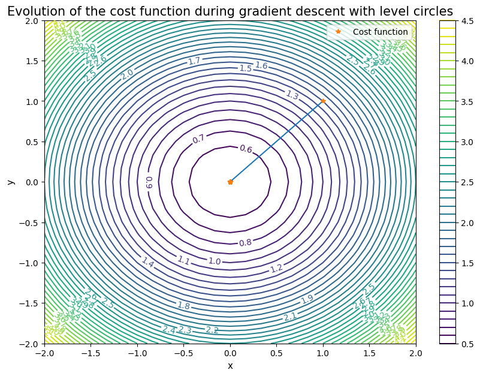

# Gradient descent with projection and augmented lagrangian algorithm

To find the infimum of an arbitrary cost function, we use here the gradient descent. Let us consider the function  that we aim at minimizing on $K\subset \mathbb{R}^2$ with $K=\{(x,y) |  x= y\}$.
We start by manually compute its gradient and we will display its evolution during gradient descent.


```python
import sys
!{sys.executable} -m pip install numpy
!{sys.executable} -m pip install matplotlib
```

### 1. Complete the following code


```python
import numpy as np
import matplotlib.pyplot as plt

def f(x1,x2):
    # function
    return ...
def df(x1,x2):
    # gradient
    return ...
def g(x1,x2):
    # constraint
    return ...
def dg(x1,x2):
    # constraint gradient
    return ...
def L(x1,x2,mu): 
    # lagrangian
    return ...
def Lc(x1,x2,mu,c): 
    # augmented lagrangian
    return ...
def dxLc(x1,x2,mu,c): 
    # augmented lagrangian gradient
    return ...
```

We need to define a norm to now how far from the global solution we are.


```python
def norm(a):
    return np.sqrt(a[0]**2+a[1]**2)
```

With $\alpha$ too big, we found out that the solution blows up in the previous exercice, a correct choice for $\alpha$ is very important. That is why, we will proceed with Armijo-Wolfe rule: 


```python
# Wolfe rule:

c1=.6
c2=.8
beta=1. #test with beta=1
eta=2.
gamma=0.01

def phik(xyk,alphak,dk,fc,mu,c):
    return fc(xyk[0]+alphak*dk[0],xyk[1]+alphak*dk[1],mu,c)

def dphik(xyk,alphak,dk,dfc,mu,c):
    grad_f=dfc(xyk[0]+alphak*dk[0],xyk[1]+alphak*dk[1],mu,c)
    return np.dot(grad_f,dk)

    
def wolfe_rule(alpha,xy_old,d,fc,dfc,mu=0,c=0): #d_x est la direction de descente d_x . grad_x <= 0
    # test f(x_new) \leq f(x_0) + c alpha ps{d_x}{grad_x}

    test = 1
    iteration = 0
    min_ = 0
    max_ = 1000
    while (phik(xy_old,alpha,d,fc,mu,c)<=(phik(xy_old,0,d,fc,mu,c)+c1*dphik(xy_old,0,d,dfc,mu,c)*alpha)) &(iteration<=500): #armijo ok
        alpha=eta*alpha
    iteration = 0
    while (test!=0)&(iteration<=500): 
        xnew0,xnew1=xy_old[0]+alpha*d[0],xy_old[1]+alpha*d[1]
        if (phik(xy_old,alpha,d,fc,mu,c)<= (phik(xy_old,0,d,fc,mu,c)+c1*dphik(xy_old,0,d,dfc,mu,c)*alpha)) & (np.dot(dfc(xnew0,xnew1,mu,c),d) >= c2*np.dot(dfc(xy_old[0],xy_old[1],mu,c),d) ):
            test = 0
        elif phik(xy_old,alpha,d,fc,mu,c)> (phik(xy_old,0,d,fc,mu,c)+c1*dphik(xy_old,0,d,dfc,mu,c)*alpha): #no armijo
            max_ = alpha
            alpha = (max_ + min_)/2
            iteration = iteration +1
        else: # armijo ok
            minorant = alpha
            alpha = (max_ + min_)/2
            iteration = iteration +1
    return alpha
```

### 2. Now we proceed with the Gradient descent algorithm with Armijo-Wolfe rule: Complete the following code


```python
def GradientDescent(fc,dfc,xy0,beta,mu=0,c=0):
    #initialization for Armijo
    alpha=beta

    # start GD algorithm
    eps=1e-6
    x0,y0=xy0[0],xy0[1] #starting points
    evolution = [[x0, y0]]
    grad_f = ... #gradient function of Lc
    cpt_grad=0

    while norm(grad_f)>=eps and cpt_grad<500:
    
        d = ... #direction
        alpha=beta  #armijo
        xy_old=np.array([x0,y0])        
        alpha=wolfe_rule(alpha,xy_old,d,fc,dfc, mu=mu,c=c) # find best alpha
        x0, y0 = ...
        evolution = np.vstack((evolution, [x0, y0]))
        grad_f = ...
        cpt_grad+=1
    return evolution
```

### 3. Complete the code of the augmented lagrangian:


```python
#initialization for Armijo
alpha=beta
## start GD algorithm
eps=1e-6
# initial points
x1,x2=1.,1.
c=1. # penalty parameter
mu=1.7 # dual variable
gold=... # not a golden function, but the constraints are very precious
gradx_f = ... # gradient of the augmented lagrangian
cpt=0 # to avoid infinite while loop
xy0=[x1,x2]


while norm(gradx_f)>eps or np.abs(g(x1,x2))>eps :
    evolution=...
    evolution_X = evolution[:, 0]
    evolution_Y = evolution[:, 1]
    x1,x2=evolution_X[-1],evolution_Y[-1] # last points
    print("x1:", x1, " x2:", x2)
    if (np.abs(g(x1,x2)))<np.abs(gold): # if ||g|| is small 
        #print("||g|| smaller",np.abs(g(x1,x2)))
        mu=... #increase mu
        print("new mu: ", mu)
        
    else:
        c=... # increase c
        print("new c: ",c)
    cpt+=1
    gold=... #updates
    gradx_f = ...
    print("norm of gradx_f: ",norm(gradx_f))
    if cpt==20:
        break
        

```

We can display the solution onto the contour of $f$ or onto the contour of $L_c$


```python
evolution_X = evolution[:, 0]
evolution_Y = evolution[:, 1]
x1 = np.linspace(-2, 2, 25)
y1 = np.linspace(-2, 2, 25)
Xx, Yy = np.meshgrid(x1, y1)
print("mu",mu)
#mu=1.#0.5

#Z = Lc(Xx, Yy,mu=mu,c=0)
Z = f(Xx, Yy)

fig= plt.figure(figsize = (10,7))
contours = plt.contour(Xx, Yy, Z, 45)
plt.clabel(contours, inline = True, fontsize = 10)
plt.title("Evolution of the cost function during gradient descent with level circles", fontsize=15)
plt.plot(evolution_X, evolution_Y)
plt.plot(evolution_X, evolution_Y, '*', label = "Cost function")
plt.xlabel('x', fontsize=11)
plt.ylabel('y', fontsize=11)
plt.colorbar()
plt.legend(loc = "upper right")
plt.show()
```

    mu 0.5000001501871618


    

    


### 4. We add new constraints: $(x,y)$ must stay in $K=[-2.,0]\times [-2,0]$. Complete the code that finds the projection of $(x,y)$ on a cuboid $K$. Then, change the gradient descent algorithm to take into account this projection step


```python
def proj(K,x):
    #K=[[l0,u0],[l1,u1]]
    l0=...
    u0=...
    l1=...
    u1=...
    return ...,...
    
```


```python
# NEW GRADIENT DESCENT ALGORITHM:

def GradientDescent(fc,dfc,xy0,beta,mu=0,c=0):
    #initialization for Armijo
    alpha=beta
    ## start GD algorithm
    eps=1e-6
    x0,y0=xy0[0],xy0[1]#1,2
    evolution = [[x0, y0]]
    grad_f = ...
    cpt_grad=0

    while norm(grad_f)>=eps and cpt_grad<500:
    
        d = ...
        #armijo
        alpha=beta
        xy_old=np.array([x0,y0])        
        alpha=wolfe_rule(alpha,xy_old,d,fc,dfc, mu=mu,c=c)
        x0, y0 = ...
        evolution = np.vstack((evolution, [x0, y0]))
        grad_f = ...
        cpt_grad+=1
    return evolution


```


```python
## AUGMENTED LAGRANGIAN WITH PROJECTION
alpha=beta
## start GD algorithm
eps=1e-6

x1,x2=1.,1.#0.5
c=1.
mu=1.7
gold=...
gradx_f = ...
cpt=0
xy0=[x1,x2]

K=...
while norm(gradx_f)>eps or np.abs(g(x1,x2))>eps :
    evolution=...
    evolution_X = evolution[:, 0]
    evolution_Y = evolution[:, 1]
    x1=evolution_X[-1]
    x2=evolution_Y[-1]
    print("x1:", x1, " x2:", x2)
    if (np.abs(g(x1,x2)))<np.abs(gold):
        #print("||g|| smaller",np.abs(g(x1,x2)))
        mu=...
        #print("mu", mu)
        
    else:
        c=...
        print("c",c)
    cpt+=1
    gold=...
    gradx_f =...
    print("norm: ",norm(gradx_f))
    print("mu: ", mu)
    if cpt==20:
        break
        
```

### 5. You should find $\mu=1$, and $(x_1,x_2)=0,0$.
The constraints $-x_1 \leq 2$ and $-x_2 \leq 2$ are inactive, and thus the associated dual variables are equal to $0$.
With $\mu=1$, we find $\lambda_1=1$ and $\lambda_2=0$ the dual variables associated to $x_1 \leq 0$ and $x_2 \leq 0$. 

Draw the new augmented lagrangian with these constraints added:


```python
evolution_X = evolution[:, 0]
evolution_Y = evolution[:, 1]
x1 = np.linspace(-2, 2, 25)
y1 = np.linspace(-2, 2, 25)
Xx, Yy = np.meshgrid(x1, y1)
print("mu",mu)
mu=1.
def Lc2(x1,x2,mu,c): 
    # augmented lagrangian with new constraints
    return ...
    
Z = Lc2(Xx, Yy,mu=mu,c=0)
#Z = f(Xx, Yy)

fig= plt.figure(figsize = (10,7))
contours = plt.contour(Xx, Yy, Z, 45)
plt.clabel(contours, inline = True, fontsize = 10)
plt.title("Evolution of the cost function during gradient descent with level circles", fontsize=15)
plt.plot(evolution_X, evolution_Y)
plt.plot(evolution_X, evolution_Y, '*', label = "Cost function")
plt.xlabel('x', fontsize=11)
plt.ylabel('y', fontsize=11)
plt.colorbar()
plt.legend(loc = "upper right")
plt.show()
```

    mu 0.5


    

    


```python

```
# Gradient descent with projection and augmented lagrangian algorithm

To find the infimum of an arbitrary cost function, we use here the gradient descent. Let us consider the function $f(x,y)=0.5(x^2+(y-1)^2)$ that we aim at minimizing on $K\subset \mathbb{R}^2$ with $K=\{(x,y) |  x= y\}$.
We start by manually compute its gradient and we will display its evolution during gradient descent.


```python
import sys
!{sys.executable} -m pip install numpy
!{sys.executable} -m pip install matplotlib
```

### 1. Complete the following code


```python
import numpy as np
import matplotlib.pyplot as plt

def f(x1,x2):
    # function
    return ...
def df(x1,x2):
    # gradient
    return ...
def g(x1,x2):
    # constraint
    return ...
def dg(x1,x2):
    # constraint gradient
    return ...
def L(x1,x2,mu): 
    # lagrangian
    return ...
def Lc(x1,x2,mu,c): 
    # augmented lagrangian
    return ...
def dxLc(x1,x2,mu,c): 
    # augmented lagrangian gradient
    return ...
```

We need to define a norm to now how far from the global solution we are.


```python
def norm(a):
    return np.sqrt(a[0]**2+a[1]**2)
```

With $\alpha$ too big, we found out that the solution blows up in the previous exercice, a correct choice for $\alpha$ is very important. That is why, we will proceed with Armijo-Wolfe rule: 


```python
# Wolfe rule:

c1=.6
c2=.8
beta=1. #test with beta=1
eta=2.
gamma=0.01

def phik(xyk,alphak,dk,fc,mu,c):
    return fc(xyk[0]+alphak*dk[0],xyk[1]+alphak*dk[1],mu,c)

def dphik(xyk,alphak,dk,dfc,mu,c):
    grad_f=dfc(xyk[0]+alphak*dk[0],xyk[1]+alphak*dk[1],mu,c)
    return np.dot(grad_f,dk)

    
def wolfe_rule(alpha,xy_old,d,fc,dfc,mu=0,c=0): #d_x est la direction de descente d_x . grad_x <= 0
    # test f(x_new) \leq f(x_0) + c alpha ps{d_x}{grad_x}

    test = 1
    iteration = 0
    min_ = 0
    max_ = 1000
    while (phik(xy_old,alpha,d,fc,mu,c)<=(phik(xy_old,0,d,fc,mu,c)+c1*dphik(xy_old,0,d,dfc,mu,c)*alpha)) &(iteration<=500): #armijo ok
        alpha=eta*alpha
    iteration = 0
    while (test!=0)&(iteration<=500): 
        xnew0,xnew1=xy_old[0]+alpha*d[0],xy_old[1]+alpha*d[1]
        if (phik(xy_old,alpha,d,fc,mu,c)<= (phik(xy_old,0,d,fc,mu,c)+c1*dphik(xy_old,0,d,dfc,mu,c)*alpha)) & (np.dot(dfc(xnew0,xnew1,mu,c),d) >= c2*np.dot(dfc(xy_old[0],xy_old[1],mu,c),d) ):
            test = 0
        elif phik(xy_old,alpha,d,fc,mu,c)> (phik(xy_old,0,d,fc,mu,c)+c1*dphik(xy_old,0,d,dfc,mu,c)*alpha): #no armijo
            max_ = alpha
            alpha = (max_ + min_)/2
            iteration = iteration +1
        else: # armijo ok
            minorant = alpha
            alpha = (max_ + min_)/2
            iteration = iteration +1
    return alpha
```

### 2. Now we proceed with the Gradient descent algorithm with Armijo-Wolfe rule: Complete the following code


```python
def GradientDescent(fc,dfc,xy0,beta,mu=0,c=0):
    #initialization for Armijo
    alpha=beta

    # start GD algorithm
    eps=1e-6
    x0,y0=xy0[0],xy0[1] #starting points
    evolution = [[x0, y0]]
    grad_f = ... #gradient function of Lc
    cpt_grad=0

    while norm(grad_f)>=eps and cpt_grad<500:
    
        d = ... #direction
        alpha=beta  #armijo
        xy_old=np.array([x0,y0])        
        alpha=wolfe_rule(alpha,xy_old,d,fc,dfc, mu=mu,c=c) # find best alpha
        x0, y0 = ...
        evolution = np.vstack((evolution, [x0, y0]))
        grad_f = ...
        cpt_grad+=1
    return evolution
```

### 3. Complete the code of the augmented lagrangian:


```python
#initialization for Armijo
alpha=beta
## start GD algorithm
eps=1e-6
# initial points
x1,x2=1.,1.
c=1. # penalty parameter
mu=1.7 # dual variable
gold=... # not a golden function, but the constraints are very precious
gradx_f = ... # gradient of the augmented lagrangian
cpt=0 # to avoid infinite while loop
xy0=[x1,x2]


while norm(gradx_f)>eps or np.abs(g(x1,x2))>eps :
    evolution=...
    evolution_X = evolution[:, 0]
    evolution_Y = evolution[:, 1]
    x1,x2=evolution_X[-1],evolution_Y[-1] # last points
    print("x1:", x1, " x2:", x2)
    if (np.abs(g(x1,x2)))<np.abs(gold): # if ||g|| is small 
        #print("||g|| smaller",np.abs(g(x1,x2)))
        mu=... #increase mu
        print("new mu: ", mu)
        
    else:
        c=... # increase c
        print("new c: ",c)
    cpt+=1
    gold=... #updates
    gradx_f = ...
    print("norm of gradx_f: ",norm(gradx_f))
    if cpt==20:
        break
        

```

We can display the solution onto the contour of $f$ or onto the contour of $L_c$


```python
evolution_X = evolution[:, 0]
evolution_Y = evolution[:, 1]
x1 = np.linspace(-2, 2, 25)
y1 = np.linspace(-2, 2, 25)
Xx, Yy = np.meshgrid(x1, y1)
print("mu",mu)
#mu=1.#0.5

#Z = Lc(Xx, Yy,mu=mu,c=0)
Z = f(Xx, Yy)

fig= plt.figure(figsize = (10,7))
contours = plt.contour(Xx, Yy, Z, 45)
plt.clabel(contours, inline = True, fontsize = 10)
plt.title("Evolution of the cost function during gradient descent with level circles", fontsize=15)
plt.plot(evolution_X, evolution_Y)
plt.plot(evolution_X, evolution_Y, '*', label = "Cost function")
plt.xlabel('x', fontsize=11)
plt.ylabel('y', fontsize=11)
plt.colorbar()
plt.legend(loc = "upper right")
plt.show()
```

    mu 0.5000001501871618


    

    


### 4. We add new constraints: $(x,y)$ must stay in $K=[-2.,0]\times [-2,0]$. Complete the code that finds the projection of $(x,y)$ on a cuboid $K$. Then, change the gradient descent algorithm to take into account this projection step


```python
def proj(K,x):
    #K=[[l0,u0],[l1,u1]]
    l0=...
    u0=...
    l1=...
    u1=...
    return ...,...
    
```


```python
# NEW GRADIENT DESCENT ALGORITHM:

def GradientDescent(fc,dfc,xy0,beta,mu=0,c=0):
    #initialization for Armijo
    alpha=beta
    ## start GD algorithm
    eps=1e-6
    x0,y0=xy0[0],xy0[1]#1,2
    evolution = [[x0, y0]]
    grad_f = ...
    cpt_grad=0

    while norm(grad_f)>=eps and cpt_grad<500:
    
        d = ...
        #armijo
        alpha=beta
        xy_old=np.array([x0,y0])        
        alpha=wolfe_rule(alpha,xy_old,d,fc,dfc, mu=mu,c=c)
        x0, y0 = ...
        evolution = np.vstack((evolution, [x0, y0]))
        grad_f = ...
        cpt_grad+=1
    return evolution


```


```python
## AUGMENTED LAGRANGIAN WITH PROJECTION
alpha=beta
## start GD algorithm
eps=1e-6

x1,x2=1.,1.#0.5
c=1.
mu=1.7
gold=...
gradx_f = ...
cpt=0
xy0=[x1,x2]

K=...
while norm(gradx_f)>eps or np.abs(g(x1,x2))>eps :
    evolution=...
    evolution_X = evolution[:, 0]
    evolution_Y = evolution[:, 1]
    x1=evolution_X[-1]
    x2=evolution_Y[-1]
    print("x1:", x1, " x2:", x2)
    if (np.abs(g(x1,x2)))<np.abs(gold):
        #print("||g|| smaller",np.abs(g(x1,x2)))
        mu=...
        #print("mu", mu)
        
    else:
        c=...
        print("c",c)
    cpt+=1
    gold=...
    gradx_f =...
    print("norm: ",norm(gradx_f))
    print("mu: ", mu)
    if cpt==20:
        break
        
```

### 5. You should find $\mu=1$, and $(x_1,x_2)=0,0$.
The constraints $-x_1 \leq 2$ and $-x_2 \leq 2$ are inactive, and thus the associated dual variables are equal to $0$.
With $\mu=1$, we find $\lambda_1=1$ and $\lambda_2=0$ the dual variables associated to $x_1 \leq 0$ and $x_2 \leq 0$. 

Draw the new augmented lagrangian with these constraints added:


```python
evolution_X = evolution[:, 0]
evolution_Y = evolution[:, 1]
x1 = np.linspace(-2, 2, 25)
y1 = np.linspace(-2, 2, 25)
Xx, Yy = np.meshgrid(x1, y1)
print("mu",mu)
mu=1.
def Lc2(x1,x2,mu,c): 
    # augmented lagrangian with new constraints
    return ...
    
Z = Lc2(Xx, Yy,mu=mu,c=0)
#Z = f(Xx, Yy)

fig= plt.figure(figsize = (10,7))
contours = plt.contour(Xx, Yy, Z, 45)
plt.clabel(contours, inline = True, fontsize = 10)
plt.title("Evolution of the cost function during gradient descent with level circles", fontsize=15)
plt.plot(evolution_X, evolution_Y)
plt.plot(evolution_X, evolution_Y, '*', label = "Cost function")
plt.xlabel('x', fontsize=11)
plt.ylabel('y', fontsize=11)
plt.colorbar()
plt.legend(loc = "upper right")
plt.show()
```

    mu 0.5


    

    


```python

```
